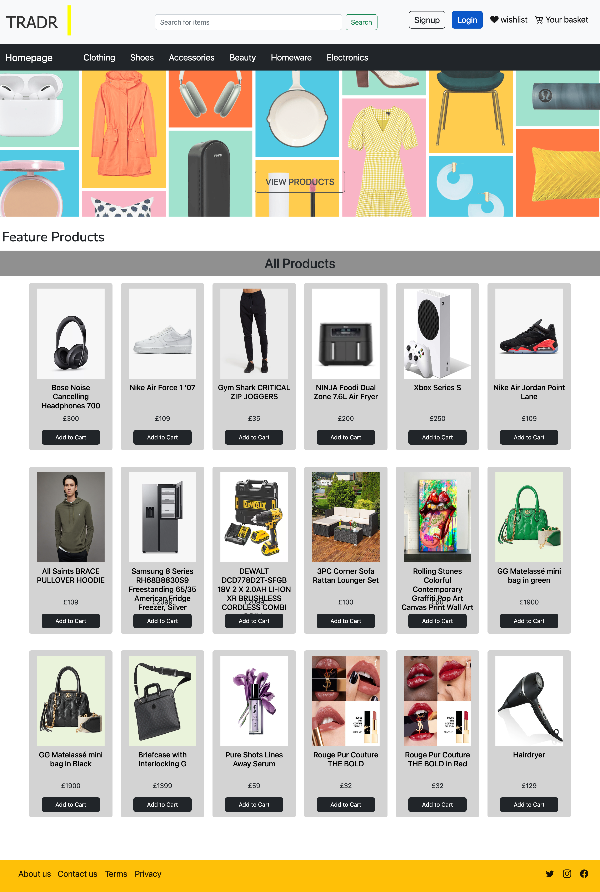

# tradr-marketplace

[](https://opensource.org/licenses/MIT)    

An app that allows users to buy, sell and review items on the marketplace

> ### Project Contributors:
>
> - [Priscilla](https://github.com/priscillaluong)
> - [Oritsegidenene](https://github.com/nenebeji)
> - [Dave](https://github.com/DaveMon79)
> - [Cyprian](https://github.com/capg84)

## Table of Contents

- [Project Description](#project-description)

- [Technologies Use](#technologies-used)

- [How to Contribute](#how-to-contribute)

- [Installation](#installation)

- [User Story and Acceptace Criteria of the Current Version of the App](#user-story-and-acceptace-criteria-of-the-current-version-of-the-app)

- [Tests](#test)

- [Questions](#questions)

- [License](#license)

- [Live Application URL](#live-application-url)

## Project Description

This is an open-source marketplace app that allows the users to register, but and sell items.

## Technologies Used

- HTML, CSS and JavaScript
- Node.js
- Express
- MySQL
- MVC paradigm
- handlebars
- Sequelize
- Chart.js

## How to Contribute

If you want to contribute to the project, you can fork the reporsitory and make your suggestions to the original contributor of the application.

## Installation

Once the repository is forked, you need to install all the npm dependecies and setup your DotEnv file. Once these steps are done, you can then seed the database and run the application.

Please note, it is assumed that you will have the environment ready to run a node.js project.

## User Story and Acceptace Criteria of the Current Version of the App

### User Story

```AS A user
I WANT a marketplace app
SO THAT I can register, buy, and sell items on the marketplace.
```

### Acceptance Criteria

```
Given a marketplace app,
WHEN I visit the site for the first time
THEN I am presented with the homepage, showing items currently on sale, includes a search option to look for items and hyperlinks to log in and sigup option

WHEN I click on the signup link
THEN I am presented with a signup form requiring my first name, last name, email and password

WHEN I submit the completed form
THEN the password is encrypted, all the data is stored in the database and my signup completes

WHEN I click on the log in link
THEN I am presented with a log in form showing the email and password fields

WHEN I submit the email and password
THEN the application validates the input and logs me in if validation is successful

WHEN I am logged in
THEN I am presented with a dashboard, having a menu on the left hand side of the screen and list of items I currently have on sale

WHEN I click the “List Item” button on the left hand menu
THEN I am presented with a form to add details of the item

WHEN I search for an item
THEN I am presented with a search result of similar products

WHEN I click on any item from the list
THEN I am presented with the details of the product including the “Add to cart” button

WHEN I click the “Add to cart” button
THEN the selected item is added to the basket from where I can checkout

WHEN I am idle on the site for more than 5 minutes
THEN I am automatically logged out and redirected to the homepage

WHEN I am logged out/not logged in
THEN I will not be able to add, update or delete anything (item or review) on the marketplace app

```

## Tests

The contributors have tested the application for errors and currently there is no known issues.

## Questions

Should you have any questions, please feel free to contact any of the contributors through their GitHub pages.

## License

[](https://opensource.org/licenses/MIT)

## Live Application Screenshot


## Live Application URL

The live application is deployed on heroku and can be accessed by visiting [https://calm-gorge-52770.herokuapp.com](https://calm-gorge-52770.herokuapp.com)

## Group Presentation URL
[Click here to view the PowerPoint Presentation](https://docs.google.com/presentation/d/1pY4_T8iH4wj2MoVnhpgqATKA_R8sb0Oa/edit?usp=sharing&ouid=108844044555454204550&rtpof=true&sd=true)
